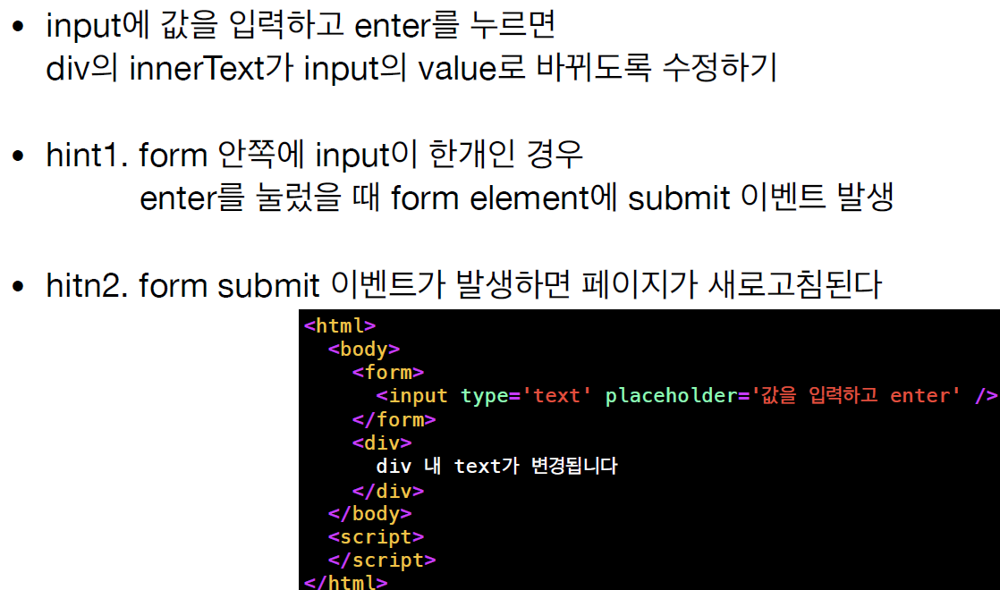

# JavaScript 실시간 강의 quiz 모음

### 1-1

```
1.admin과 name이라는 변수를 선언하세요.
2.name에 값으로 "John"을 할당해 보세요.
3.name의 값을 admin에 복사해 보세요.
4.admin의 값을 console에 출력해보세요.
"John"이 출력되어야 합니다.
```

### 1-2

```
아래 스크립트의 결과를 예측해 보세요.
let name = "Ilya";
console.log(`hello ${1}`);
console.log(`hello ${"name"}`);
console.log(`hello ${name}`);
```

### 1-3


### 1-4


### 1-5


### 1-6


### 2-1


### 2-2


### 2-3


### 2-4


### 2-5


### 3-1


### 3-2


### 3-3

```
1부터 100사이의 숫자 중,
7로 나누었을 때 나머지가 2 혹은 5인 숫자만 출력하기
```

### 4-1


### 4-2

```
4-1에서 함수선언식으로 작성한 함수를
함수 표현식으로 바꾸어보세요!
```

### 4-3

```
지난 시간에 작성한 별찍기 코드(3-2)를,
lineCount를 매개변수로 받는 함수로 수정해보세요!
```

### 4-4


### 4-5


### 4-6

```
아까 작성한 checkBoolean 함수를 화살표 함수로 변경해보기
```

### 5-1

```
다음 각 동작을 한 줄씩, 코드로 작성해보세요.
1. 빈 객체 user를 만듭니다.
2. user에 키가 name, 값이 John인 프로퍼티를 추가하세요.
3. user에 키가 surname, 값이 Smith인 프로퍼티를 추가하세요.
4. name의 값을 Pete로 수정해보세요.
```

### 5-2

```
다음 코드를 [1, 5, 2, 3] 배열을 출력하는 코드로 바꾸어보세요
```

```js
const original = [1, 5, 2, 3];
const mapFunction = (item, index) => {
  const obj = { item, index };
  console.log(obj);
  return undefined;
};
const a = original.map(mapFunction);
console.log(a);
```

### 5-3

```
다음 코드를 [2, 10, 4, 6] 배열을 출력하는 코드로 바꾸어보세요.
```

```js
const original = [1, 5, 2, 3];
const mapFunction = (item, index) => {
  const obj = { item, index };
  console.log(obj);
  return undefined;
};
const a = original.map(mapFunction);
console.log(a);
```

### 5-4

```
다음 코드를 [1, 5, 2, 3] 배열을 출력하는 코드로 바꾸어보세요.
```

```js
const original = [{ a: 1 }, { a: 5 }, { a: 2 }, { a: 3 }];
const mapFunction = (item, index) => {
  const obj = { item, index };
  console.log(obj);
  return undefined;
};
const a = original.map(mapFunction);
console.log(a);
```

### 5-5

```
다음 코드를 [2, 10, 4, 6] 배열을 출력하는 코드로 바꾸어보세요.
```

```js
const original = [{ a: 1 }, { a: 5 }, { a: 2 }, { a: 3 }];
const mapFunction = (item, index) => {
  const obj = { item, index };
  console.log(obj);
  return undefined;
};
const a = original.map(mapFunction);
console.log(a);
```

### 5-6

```
다음 코드를 [{ a: 2 }, { a: 10 }, { a: 4 }, { a: 6 }]
배열을 출력하는 코드로 바꾸어보세요.
주의) 기존 original 배열이 가진 값이 바뀌어선 안됩니다.
```

```js
const original = [{ a: 1 }, { a: 5 }, { a: 2 }, { a: 3 }];
const mapFunction = (item, index) => {
  const obj = { item, index };
  console.log(obj);
  return undefined;
};
const a = original.map(mapFunction);
console.log(a);
```

### 5-7

```
다음 코드를 { a: 5 } 객체를 출력하는 코드로 바꾸어보세요.
주의) 기존 original 배열이 가진 값이 바뀌어선 안됩니다.
```

```js
const original = [{ a: 1 }, { a: 5 }, { a: 2 }, { a: 3 }];
const findFunction = (item, index) => {
  const obj = { item, index };
  console.log(obj);
  return false;
};
const a = original.find(findFunction);
console.log(a);
```

### 5-8

```
다음과 같이 동작하도록 findAge 함수를 구현하세요.
```

```js
const arr = [
  {
    name: 'kim',
    age: 10,
  },
  {
    name: 'park',
    age: 15,
  },
  {
    name: 'lee',
    age: 12,
  },
  {
    name: 'choi',
    age: 13,
  },
  {
    name: 'jin',
    age: 20,
  },
  {
    name: 'woo',
    age: 30,
  },
];
findAge(' jIN'); // 20;
findAge(' wOO '); // 30;
```

### 5-9

```
다음과 같이 동작하도록 findAge 함수를 구현하세요.
```

```js
const arr = [
  {
    name: 'kim',
    age: 10,
  },
  {
    name: 'choi',
    age: 13,
  },
  {
    name: 'jin',
    age: 20,
  },
  {
    name: 'woo',
    age: 50,
  },
  {
    name: 'woo',
    age: 20,
  },
  {
    name: 'woo',
    age: 30,
  },
];
findAge(' jIN'); // [20];
findAge(' wOO '); // [50, 30, 20];
```

### 5-10

```
다음과 같이 동작하도록 findAge 함수를 구현하세요.
```

```js
const arr = [
  {
    name: 'kim',
    age: 10,
  },
  {
    name: 'park',
    age: 15,
  },
  {
    name: 'lee',
    age: 12,
  },
  {
    name: 'choi',
    age: 13,
  },
  {
    name: 'jin',
    age: 20,
  },
  {
    name: 'woo',
    age: 30,
  },
];
arr.find(findAge('jin')).age; // 20
arr.find(findAge('woo')).age; // 30
```

### 5-11

```
객체가 들어있는 배열을 인자로 받아
객체를 반환하는 toObject 함수 구현하기
```

```js
const arr = [{
name: 'kim',
age: 10,
}, {
name: 'park',
age: 15,
}, {
name: 'lee',
age: 12,
}, {
name: 'choi',
age: 13,
}, {
name: 'jin',
age: 20,
}, {
name: 'woo',
age: 30,
}];
console.log(toObject(arr));
/*
{
kim: 10,
park: 15,
lee: 12,
choi: 13,
jin: 20,
woo: 30,
}
```

### 6-1

```
document.createElement 메소드와
document.body 라는 element에 있는 appendChild 메소드를 활용하여
body에 div element를 추가해보세요.
```

### 6-2

```
연습문제 1-0 에서 작성한 코드를 기반으로,
div.style 혹은 div.className 프로퍼티를 수정하여
width, height, background-color 를 다음과 같이 수정해보세요.
width: 100px;
height: 100px;
background-color: red;
주의) element.style property에 작성할 땐
css property명을 camelCalse로 적습니다.
```

### 6-3


### 6-4

```
input element에 event listener를 추가하여,
input element의 값이 바뀔 때 바뀐 값을 console에 출력하도록
script를 작성해보세요.
```

```html
<html>
  <body>
    <input type="number" />
  </body>
  <script></script>
</html>
```

### 6-5

```
button element에 event listener를 추가하여
button을 click했을 때 input element의 값을 출력하도록
script를 작성해보세요.
hint1. input element 에 event listener를 추가하여
값을 변수에 담는 방법도 있습니다.
hint 2. input element 의 value에 바로 접근하는 방법도 있습니다.
```

```html
<html>
  <body>
    <input type="number" />
    <button id="button">더하기</button>
  </body>
  <script></script>
</html>
```

### 6-6

```
첫번째 인풋과 두번째 인풋에 숫자를 입력하고,
더하기 버튼을 클릭하면 결과가 세번째 인풋에 출력되도록 수정
html 상에서 id나 class는 수정해도 ok
```

```html
<html>
  <body>
    <input type="number" /> + <input type="number" /> =
    <input type="number" readonly />
    <button id="button">더하기</button>
  </body>
  <script></script>
</html>
```

### 7-1

```
input에 값을 입력하고 enter를 누르면
console에 input의 값을 출력하도록 script를 작성해보세요.
```

```html
<html>
  <body>
    <input type="text" placeholder="값을 입력하고 enter" />
  </body>
  <script></script>
</html>
```

### 7-2

```
input에 값을 입력하고 enter를 누르면
div에 input의 값을 출력하도록 script를 작성해보세요.
```

```html
<html>
  <body>
    <input type="text" placeholder="값을 입력하고 enter" />
    <div>div 내 text가 변경됩니다</div>
  </body>
  <script></script>
</html>
```

### 7-3


### 7-4



### 7-5

```
input element에서 값을 입력 후 enter를 누르면
input element의 value가 초기화 되도록 (= value를 빈 문자열로
만들도록) html과 script를 작성해 보세요.
```

### 7-6

```
앞서 작성한 7-5의 조건을 만족하면서, input element에서 enter를 누르면
document.body element에 div를 추가하도록 html 및 script를 작성해 보세요.
```

### 7-7

```
앞서 작성한 7-5 의 조건을 만족하면서
input element에 color를 입력하고 enter를 누르면,
document.body element에 해당 color를 background로 갖는 div를 추가하도록
html 및 script를 작성해 보세요.
```

### 7-8

```
앞서 작성한 7-7 의 조건을 만족하면서,
추가된 div 를 클릭하여 제거할 수 있도록 코드를 작성해 보세요.
```

### 7-9

```
앞서 배운 event.target, event.currentTarget 을 활용하여
div를 제거하기 위한 event listener를
div 갯수만큼 만들지 않고 해결할 방법이 있을지 고민해 보세요.
```
